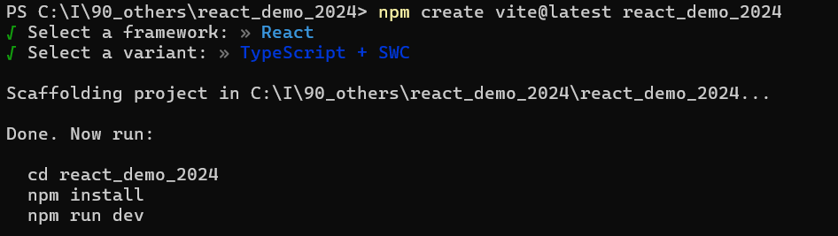

# react_demo_2024
vite+vitest+eslint+prettier+husky &amp; lint-staged+storybook+tailwindcss+shadcn/ui+github actions

### vite環境構築開始
```
npm create vite@latest react_demo_2024
npm install
npm run dev
```
